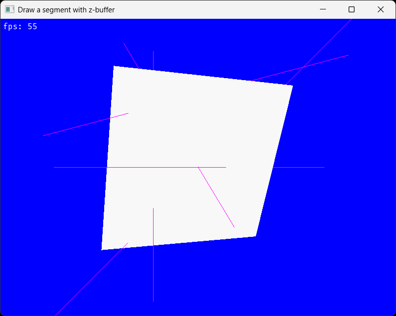
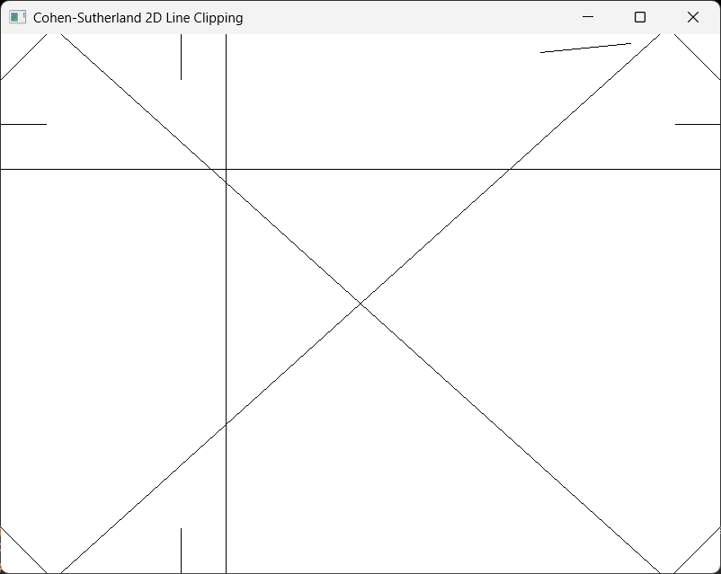
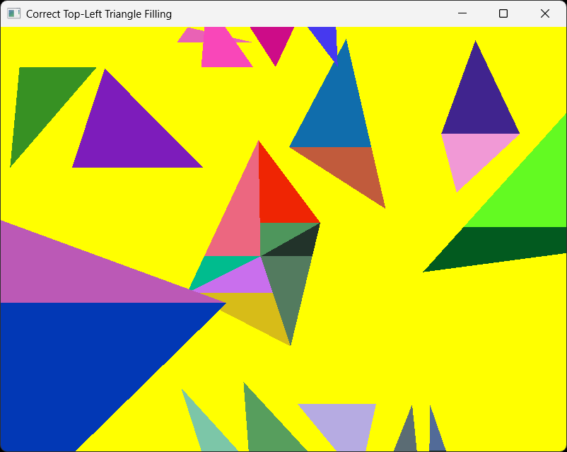
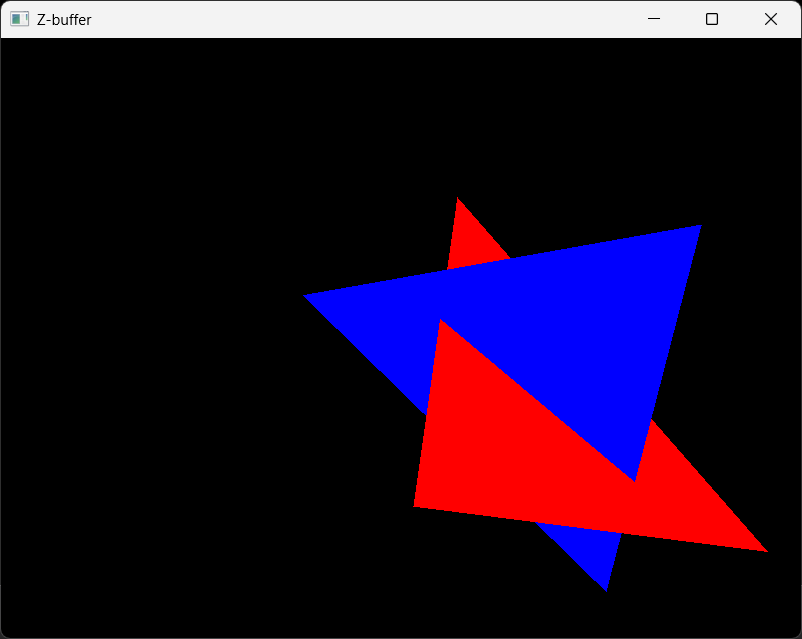
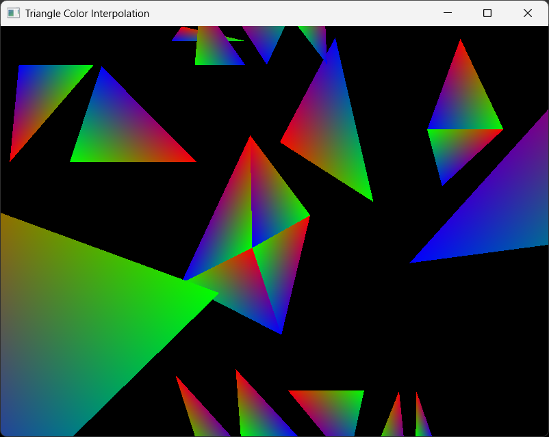
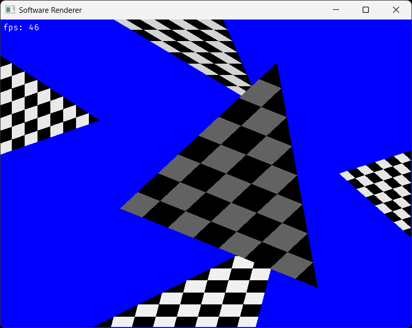
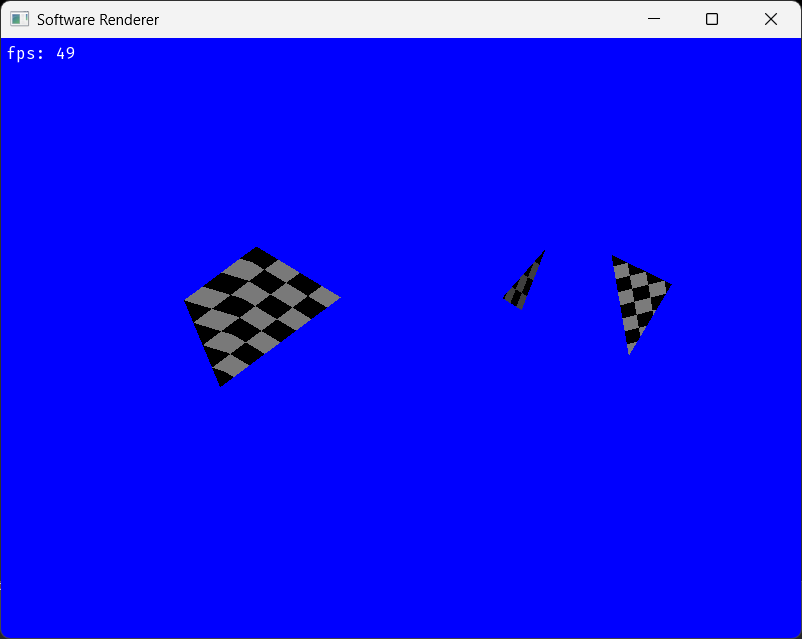
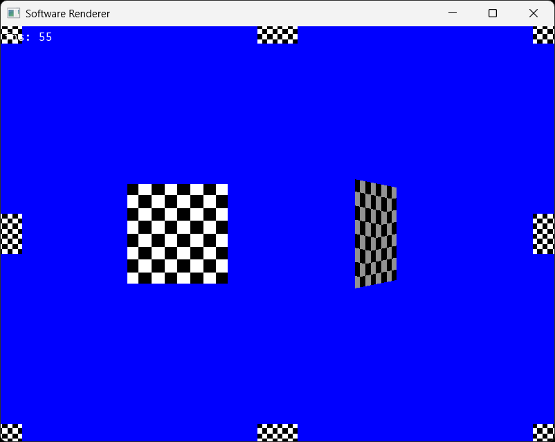

# Software Renderer

https://github.com/user-attachments/assets/6701d146-6460-4131-9a6a-c8930ce3d4fa

## Features
### Line drawing (DDA, z-buffer)

### Line clipping (Cohen–Sutherland)

### Triangle filling (top-left strategy, screen space clipping)

### Z-buffering

### Color interpolation

### Frustum culling

### Near plane clipping

### Texture mapping (affine)

## Documentation
The /docs directory contains GeoGebra, Mathcad and other files that contain visualization and formal derivation of all mathematical constructions used in the renderer: rotation matrices, clipping algorithms etc.

## Notes
- Вырожденные треугольники: проверить/убедиться/доказать, что для вырожденного треугольника (который является смежным с, например, двумя соседними "нормальными") справедливо следующее: если такой треугольник имеет хотя бы один фрагмент, который растеризуется, то этот фрагмент принадлежит только этому треугольнику и, соответственно, растеризуется только в контексте этого треугольники, то есть, смежные треугольники данный фрагмент не растеризуют, а значит, при реализации, например, прозрачности, данный фрагмент не будет закрашен дважды.

## Model
https://skfb.ly/6V6GL
